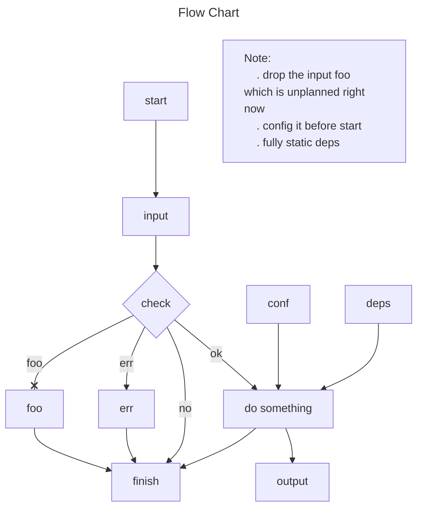

- Put text after its node or link; no spaces between text and its node or link.
- end can be text; id alternatives: End, END, endnode, finish, close, exit.
- No id or text like -o-, -x-; use capital -O-, -X-, or spaces - o -, - x -.
- Arrow on single left side of a link is invalid.
- Chain sequential links on one line; put parallel links on separate lines.
- Similar diagram tools: graphviz (dot), yED, draw.io, visio.

