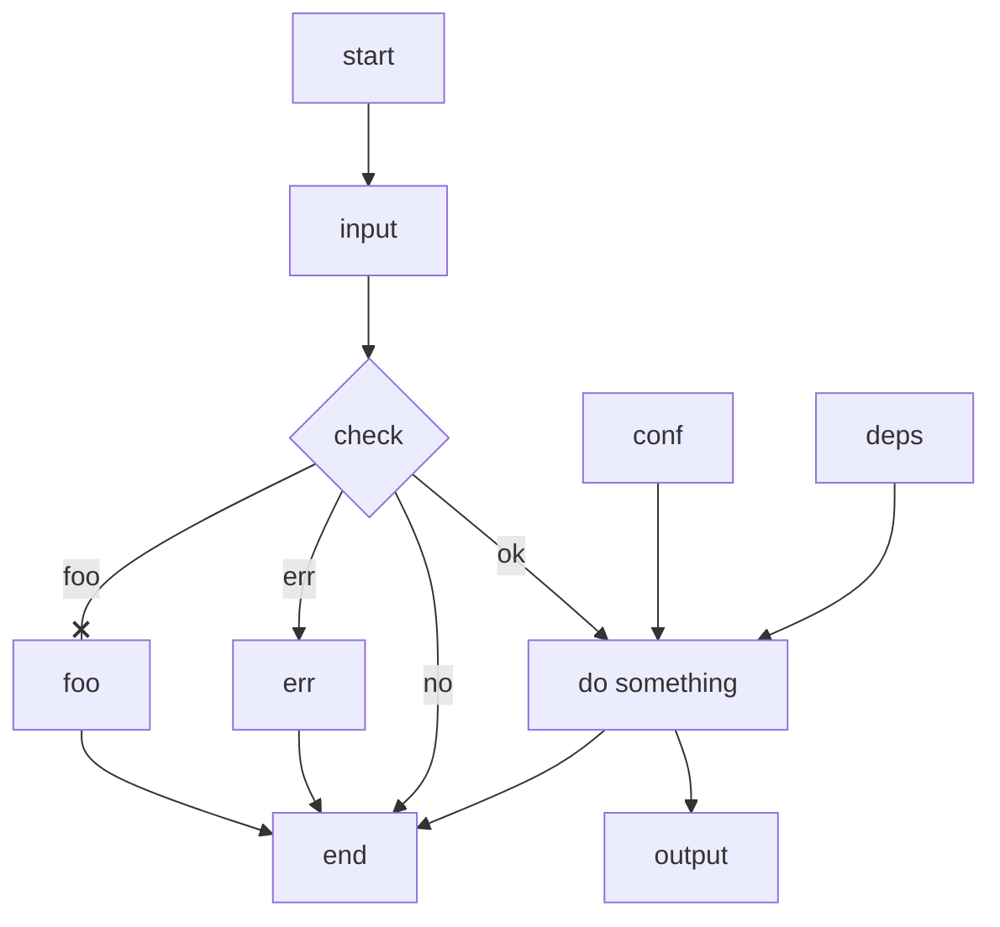

- Put text after its node or link, with no spaces.
- end can be text; use alternatives like End, END, endnode as id.
- No id or text like -o-, -x-; use capital or spaces like -O-, -X-, - o -, - x -.
- Link with arrow on only left is invalid.
- Chain sequential links on one line; put parallel links on separate lines.
- Similar tools: graphviz (dot), yED, draw.io, visio.

