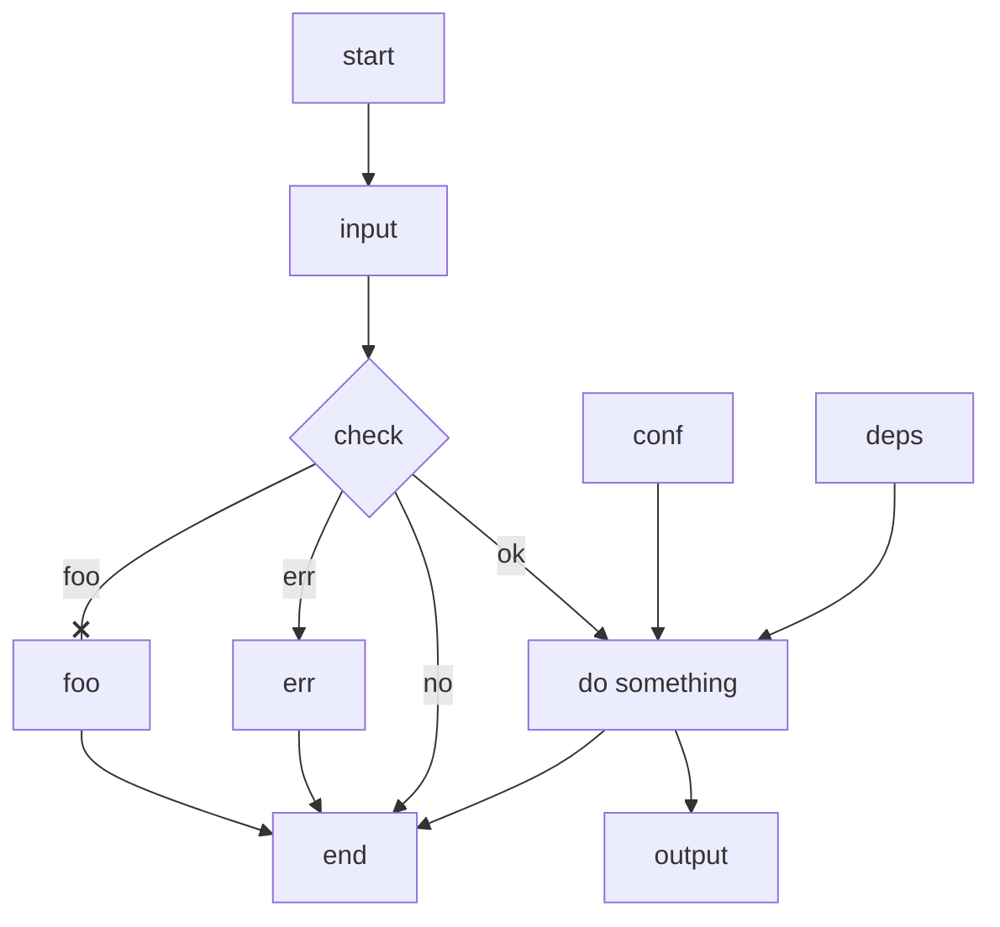

- Put text after its node or link.
- No spaces between text and its node or link.
- Link may have multi-directional arrows but its text is always after it.
- end can be text, use a different value like End, END, endnode as id.
- Avoid -o-, -x-, cap O or X, or add space between it and dash.

- Alternatives: yED, visio, graphviz/dot, draw.io .

