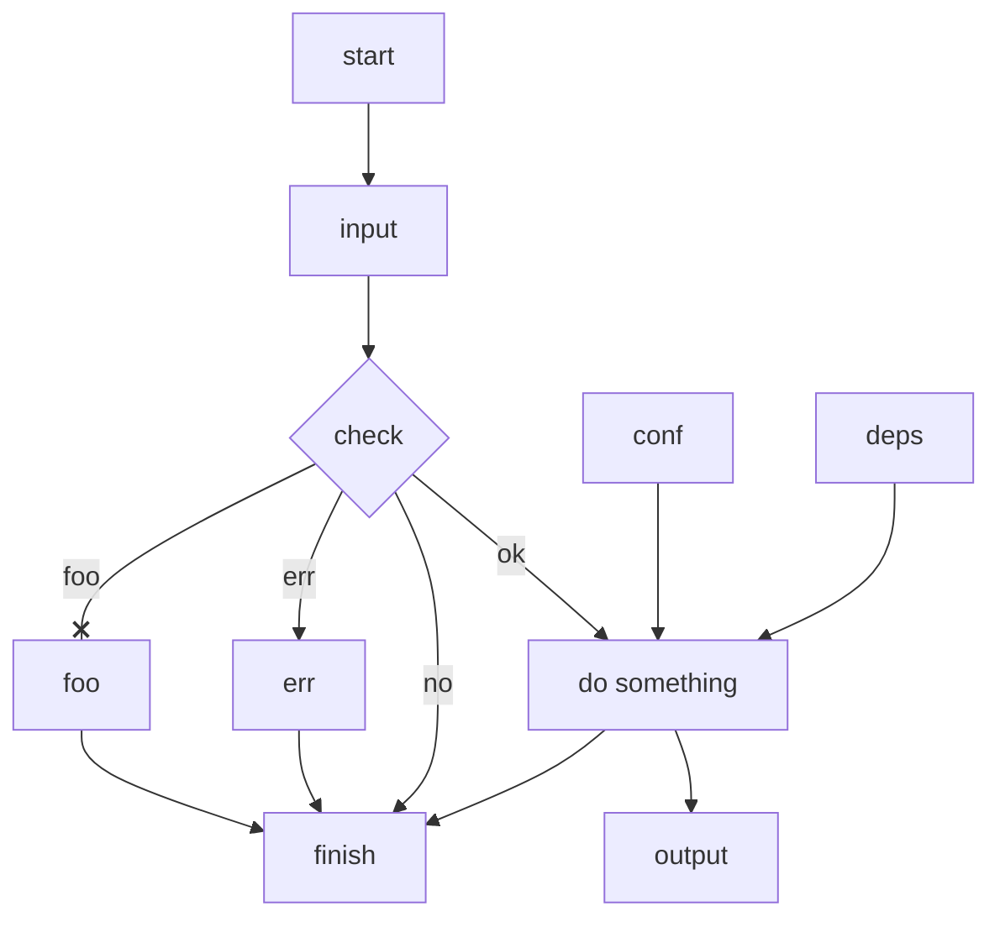

- Put text after its node or link; no spaces before text.
- end can be text; id alternatives: End, END, endnode, finish, close, exit.
- No id or text like -o-, -x-; use capital -O-, -X-, or spaces - o -, - x -.
- Link with arrow on only its left is invalid.
- Chain sequential links on one line; put parallel links on separate lines.
- Similar tools: graphviz (dot), yED, draw.io, visio.

