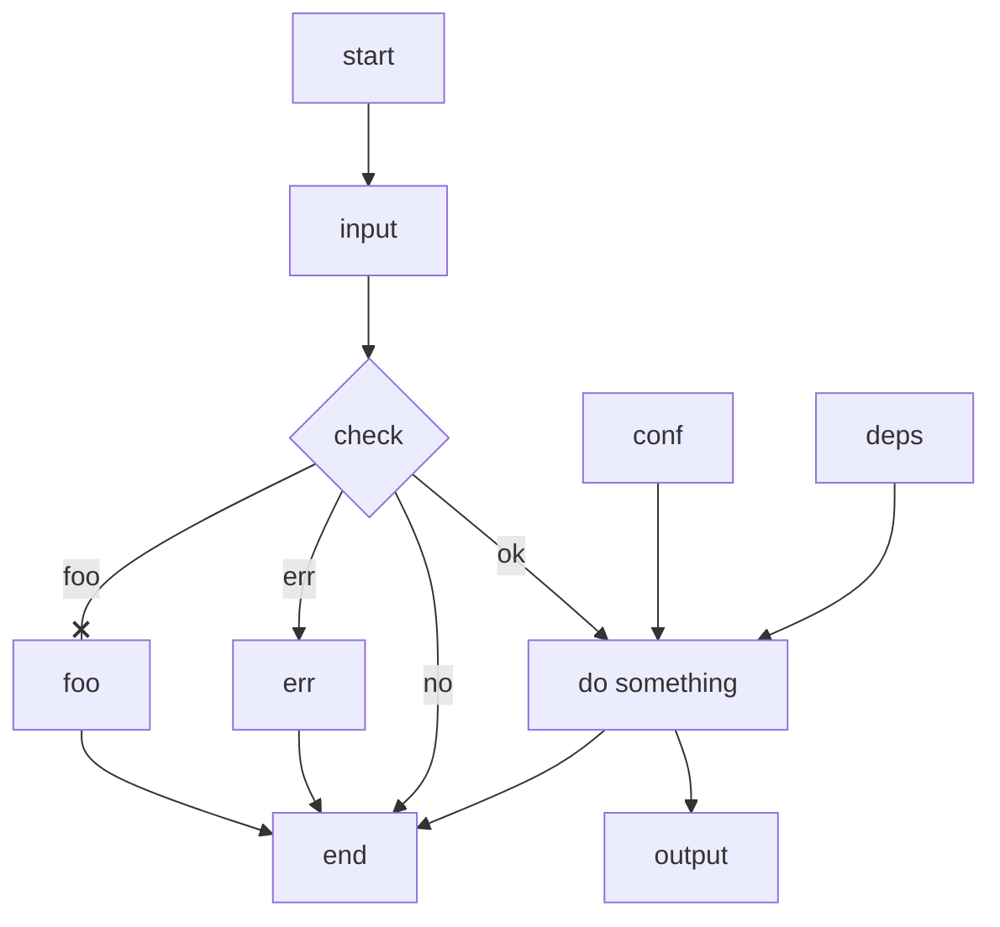

- Put text after its node or link.
- No spaces between text and its node or link.
- Link may have multi-directional arrows but its text is always after it.
- end can be text, but use alternatives like End, END, endnode as id.
- Avoid id or text -o-, -x-; capitalize O or X, or add space between it and dash.
- Chain sequential links on one line; place parallel links on separate lines.

- Alternatives: yED, visio, graphviz (dot), draw.io .

